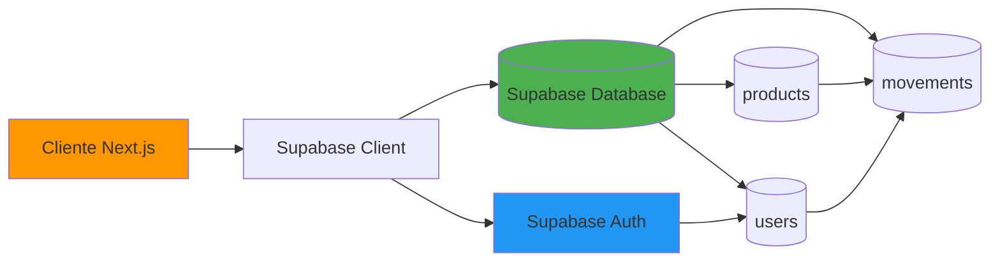
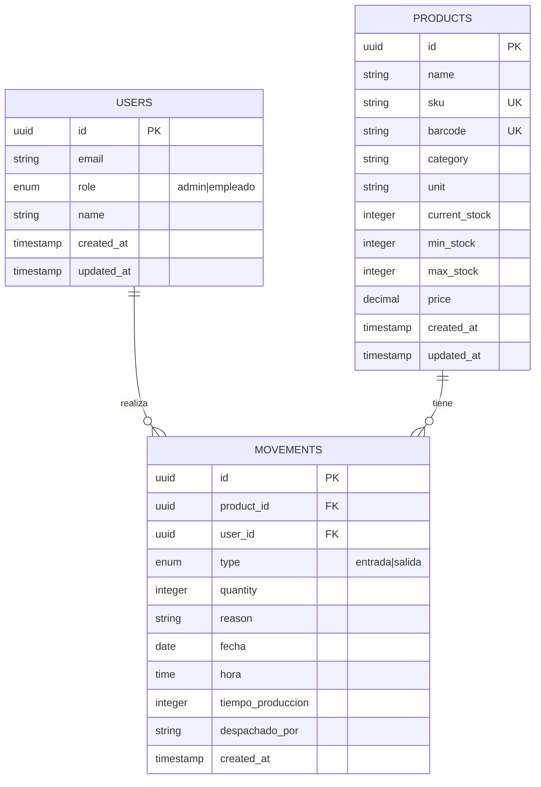
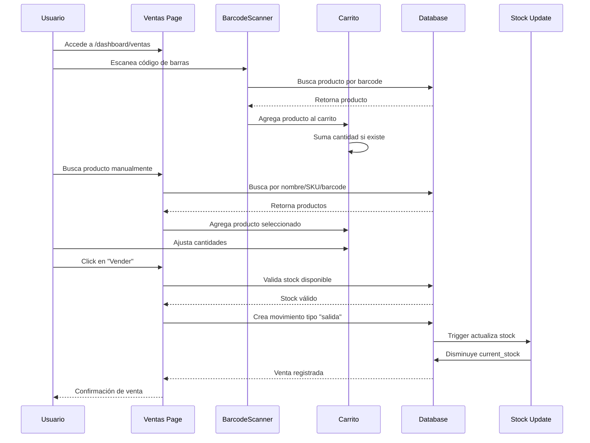
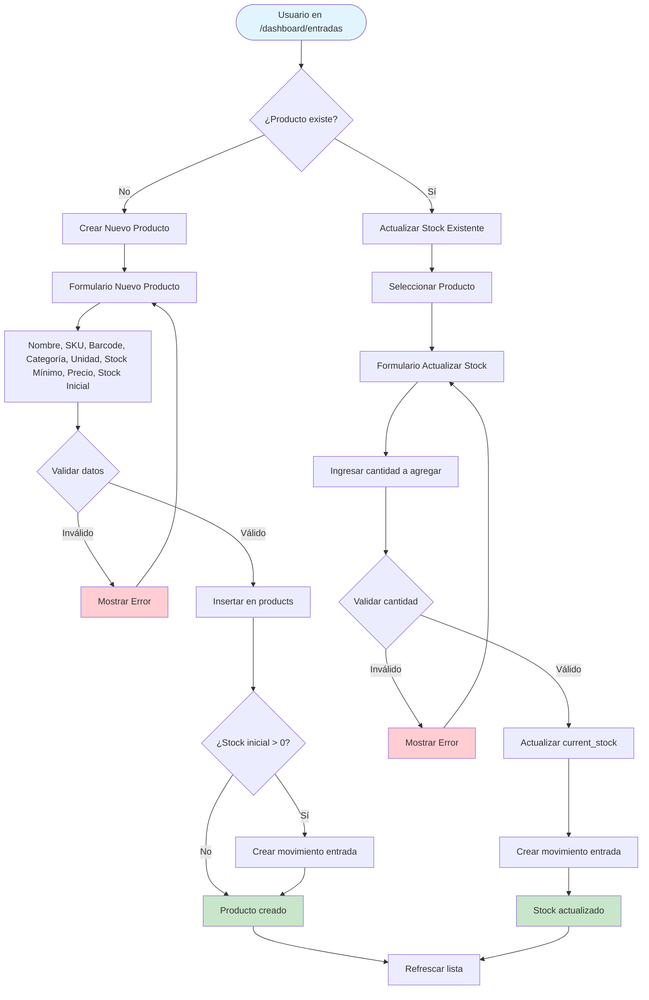
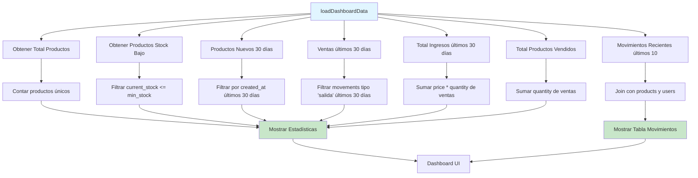
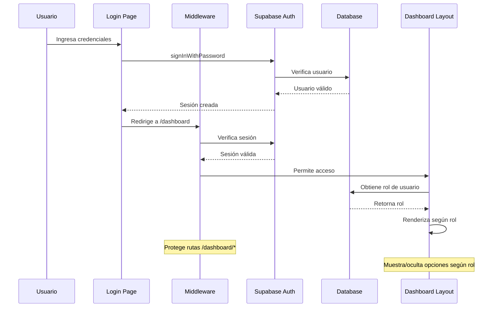
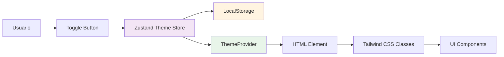
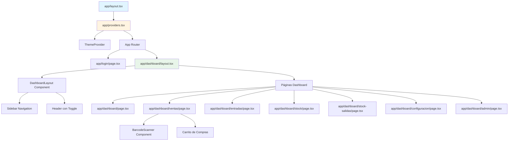
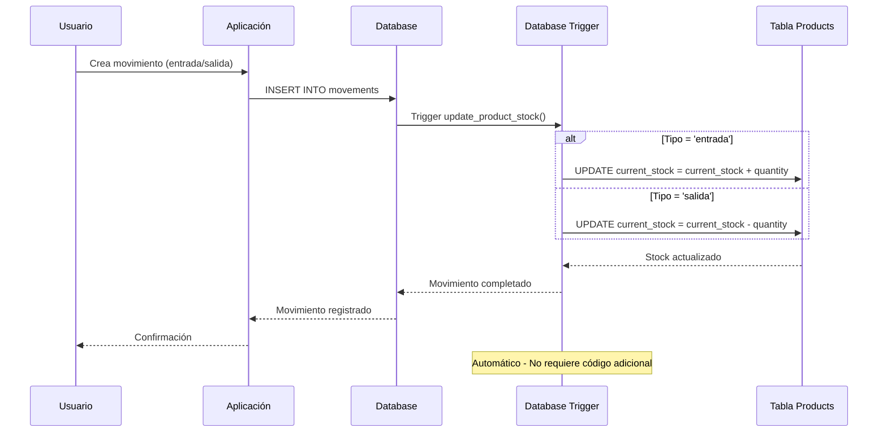

# 📊 Diagrama de Flujo - StockApp Company

## 🏗️ Arquitectura General de la Aplicación

```mermaid
graph TB
    Start([Usuario]) --> Login{¿Autenticado?}
    Login -->|No| LoginPage[/login/page.tsx]
    LoginPage -->|Credenciales válidas| Auth[Supabase Auth]
    Auth -->|Sesión válida| DashboardLayout[DashboardLayout]
    Login -->|Sí| DashboardLayout
    
    DashboardLayout --> Sidebar[Sidebar Navigation]
    DashboardLayout --> Header[Header con Toggle Tema]
    DashboardLayout --> Content[Contenido de Página]
    
    Sidebar --> Dashboard[/dashboard - Vista General]
    Sidebar --> Ventas[/dashboard/ventas - Venta Producto]
    Sidebar --> Entradas[/dashboard/entradas - Agregar Producto]
    Sidebar --> Stock[/dashboard/stock - Gestión de Stocks]
    Sidebar --> Salidas[/dashboard/stock-salidas - Historial Salidas]
    Sidebar --> Config[/dashboard/configuracion - Configuración]
    Sidebar --> Admin[/dashboard/admin - Administración]
    
    Dashboard --> Stats[Estadísticas Dashboard]
    Dashboard --> RecentMovements[Movimientos Recientes]
    
    style Start fill:#e1f5ff
    style Login fill:#fff4e1
    style DashboardLayout fill:#e8f5e9
    style Auth fill:#f3e5f5
```

## 🔄 Flujo de Datos Principal



## 📦 Estructura de Base de Datos



## 🛒 Flujo de Venta de Productos



## 📥 Flujo de Entrada de Productos



## 📊 Flujo del Dashboard



## 🔐 Flujo de Autenticación



## 🎨 Flujo de Tema (Light/Dark)



## 📱 Estructura de Componentes



## 🔄 Flujo de Actualización de Stock



## 📋 Páginas y Funcionalidades

| Página | Ruta | Funcionalidad Principal | Componentes Clave |
|--------|------|------------------------|-------------------|
| **Login** | `/login` | Autenticación de usuarios | Formulario de login |
| **Dashboard** | `/dashboard` | Vista general con estadísticas | Cards de estadísticas, Tabla de movimientos |
| **Ventas** | `/dashboard/ventas` | Proceso de venta de productos | BarcodeScanner, Carrito, Resumen |
| **Entradas** | `/dashboard/entradas` | Agregar productos y actualizar stock | Formulario nuevo producto, Selector de productos |
| **Stock** | `/dashboard/stock` | Gestión y visualización de inventario | Tabla de productos, Filtros, Modal edición |
| **Stock Salidas** | `/dashboard/stock-salidas` | Historial de ventas/salidas | Tabla de movimientos, Filtros por fecha |
| **Configuración** | `/dashboard/configuracion` | Perfil de usuario | Formularios email, nombre, contraseña |
| **Admin** | `/dashboard/admin` | Administración de usuarios | Gestión de roles (solo admin) |

## 🗂️ Estructura de Archivos

```
StockApp-Company/
├── app/
│   ├── dashboard/
│   │   ├── page.tsx              # Dashboard principal
│   │   ├── layout.tsx            # Layout del dashboard
│   │   ├── ventas/page.tsx       # Página de ventas
│   │   ├── entradas/page.tsx     # Página de entradas
│   │   ├── stock/page.tsx        # Gestión de stock
│   │   ├── stock-salidas/page.tsx # Historial de salidas
│   │   ├── configuracion/page.tsx # Configuración usuario
│   │   └── admin/page.tsx        # Administración
│   ├── login/page.tsx            # Página de login
│   ├── layout.tsx                # Layout raíz
│   └── providers.tsx             # Providers (Theme)
├── components/
│   ├── Layout/
│   │   └── DashboardLayout.tsx   # Layout con sidebar
│   ├── BarcodeScanner.tsx        # Componente escáner
│   └── ThemeProvider.tsx         # Provider de tema
├── lib/
│   ├── supabase/
│   │   └── client.ts             # Cliente Supabase
│   ├── store/
│   │   └── themeStore.ts         # Store Zustand (tema)
│   └── types.ts                  # Tipos TypeScript
└── supabase/
    └── schema.sql                # Schema de base de datos
```

## 🔑 Conceptos Clave

### **Autenticación y Autorización**
- Supabase Auth maneja la autenticación
- Middleware protege rutas `/dashboard/*`
- Roles: `admin` y `empleado`
- RLS (Row Level Security) en Supabase

### **Gestión de Estado**
- **Local**: `useState` para estado de componentes
- **Global**: Zustand para tema (light/dark)
- **Persistencia**: LocalStorage para preferencia de tema

### **Base de Datos**
- **Trigger automático**: Actualiza stock al crear movimientos
- **Relaciones**: Foreign keys entre users, products y movements
- **Índices**: Optimización en búsquedas por SKU, barcode, fechas

### **Funcionalidades Especiales**
- **Escáner de código de barras**: Integración USB/HID
- **Tema claro/oscuro**: Toggle global con persistencia
- **Exportación CSV**: Descarga de datos de tablas
- **SweetAlert2**: Alertas y confirmaciones mejoradas

---

**Nota**: Este diagrama representa la estructura actual de la aplicación. Para visualizar los diagramas Mermaid, puedes usar:
- [Mermaid Live Editor](https://mermaid.live/)
- Extensiones de VS Code como "Markdown Preview Mermaid Support"
- GitHub (renderiza automáticamente en archivos .md)

